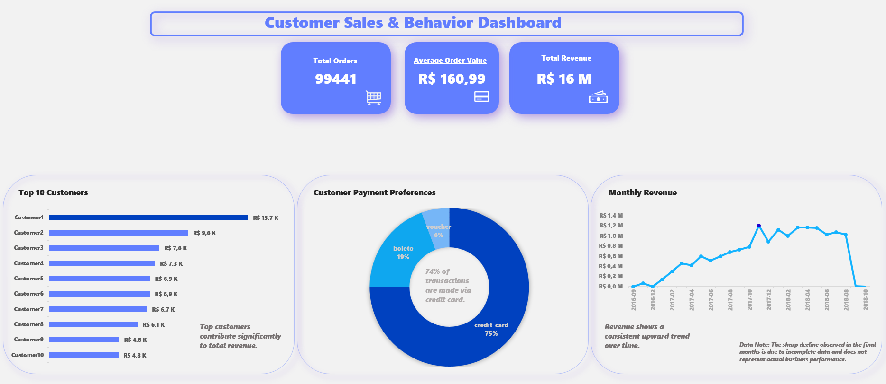
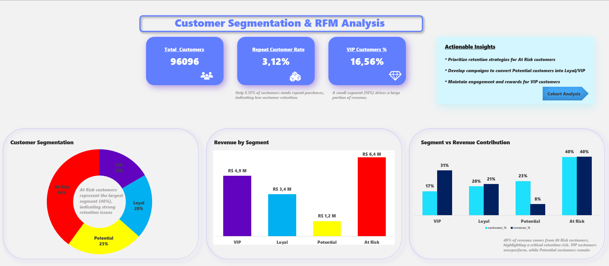
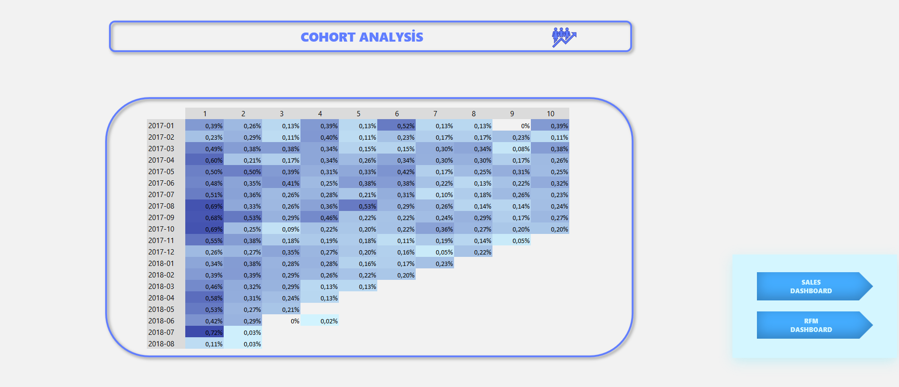

# 🛍️ Customer Segmentation & Retention Analysis (RFM + Cohort)

## 📌 Project Overview

This project analyzes customer behavior using the Olist e-commerce dataset.
The goal is to understand customer value, purchasing patterns, and retention performance.

The analysis combines:

* **RFM Segmentation (Recency, Frequency, Monetary)**
* **Cohort Analysis (Customer Retention)**
* **Key Business KPIs**

---

## 🎯 Objectives

* Identify high-value customers
* Measure customer retention and churn behavior
* Evaluate repeat purchase patterns
* Provide actionable business insights

---

## 📊 Key Metrics

* **Total Customers:** 96,096
* **Total Orders:** 99,441
* **Total Revenue:** ~R$16M
* **Average Order Value:** ~R$160.99
* **Repeat Customer Rate:** ~3%
* **VIP Customers:** ~16.6%

---

## 🧠 Methodology

### 🔹 RFM Analysis

Customers are segmented based on:

* **Recency:** Days since last purchase
* **Frequency:** Number of orders
* **Monetary:** Total spending

Scores are assigned using **NTILE(5)** to create relative rankings.

### 🔹 Customer Segments

* **VIP:** High value, frequent, recent customers
* **Loyal:** Regular and engaged customers
* **Potential:** Recent but low frequency customers
* **At Risk:** Inactive customers with low engagement

---

### 🔹 Cohort Analysis

Customers are grouped by their **first purchase month**.

Retention is calculated by tracking:

* How many customers return in subsequent months

This helps identify:

* Churn patterns
* Customer lifecycle behavior

---

## 📈 Key Insights

* **A small segment of high-value (VIP) customers drives a disproportionate share of total revenue.**

* **A large proportion of customers are classified as “At Risk”, indicating significant retention challenges.**

* **Customer retention declines sharply after the first purchase, with very few users returning in subsequent months.**

* **The repeat purchase rate is low (~3%), suggesting that most customers make only a single transaction.**

* **The business is effective at acquiring customers but struggles significantly with retention.**

---

## 🚀 Tools & Technologies

* SQL (SQLite)
* Excel (Pivot Tables, Heatmaps)
* Data Visualization (Dashboard)

---

## 📊 Dashboard Features

* KPI summary (Revenue, Orders, Customers)
* RFM segmentation distribution
* Revenue by segment
* Monthly revenue trend
* Cohort retention heatmap
* Top customers analysis
* 
### Sales Dashboard

### RFM Dashboard

### Cohort Analysis

---

## 💡 Business Recommendations

* Improve **customer retention strategies** (loyalty programs, remarketing)
* Focus on converting **Potential → Loyal/VIP**
* Prevent churn by targeting **At Risk customers**
* Maintain engagement with **VIP customers** through rewards

---

## 📁 Dataset
This project uses the Brazilian E-Commerce Public Dataset by Olist.

- Source: https://www.kaggle.com/datasets/olistbr/brazilian-ecommerce
- Includes:
  - Orders
  - Customers
  - Payments
  - Products
  - Reviews

The dataset contains real-world transactional data from a Brazilian e-commerce platform.

Note: Data was cleaned and transformed using SQL before analysis.

---

## ✨ Conclusion

This project highlights that while customer acquisition is strong, retention is the main challenge.
Improving retention strategies can significantly increase long-term revenue and customer lifetime value.

---
